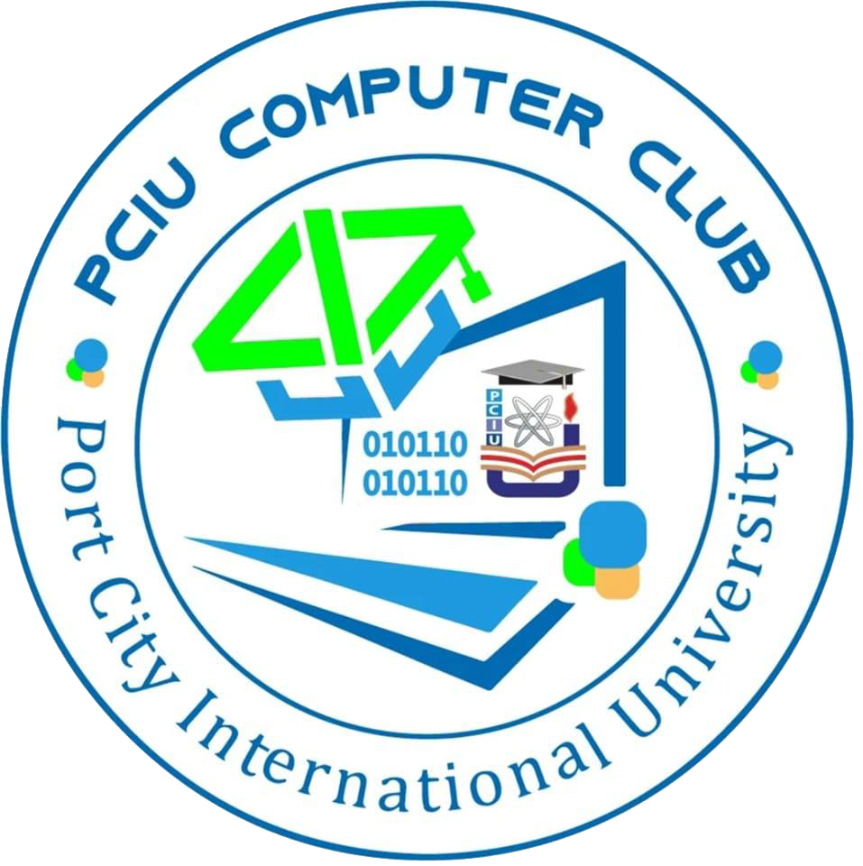

  

# PCCC Identity Portal

**PCCC Identity Portal** is a helpful tool and web application developed to identify the registered members of the **PCIU Computer Club**. It enables PCCC Admins to quickly verify whether a student is an official club member by simply entering the Student ID.

---

### ✅ Future Expected Features:
- Integrate Event Page
- Add New Student  
- Delete Existing Student  
- Check Student Payment Status  

---

**This project is an official initiative of the © PCIU Computer Club, led by Suprio Das, IT Secretary.**

> ⚠️ **Warning:** Unauthorized copying, reproduction, or use of this project or any part of its codebase is strictly prohibited. Proper permission must be obtained from the PCIU Computer Club or Owner before any reuse.
